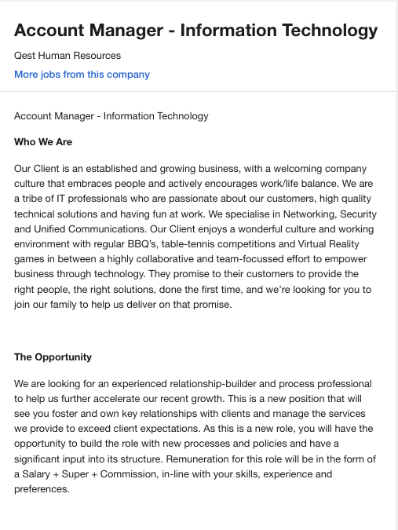
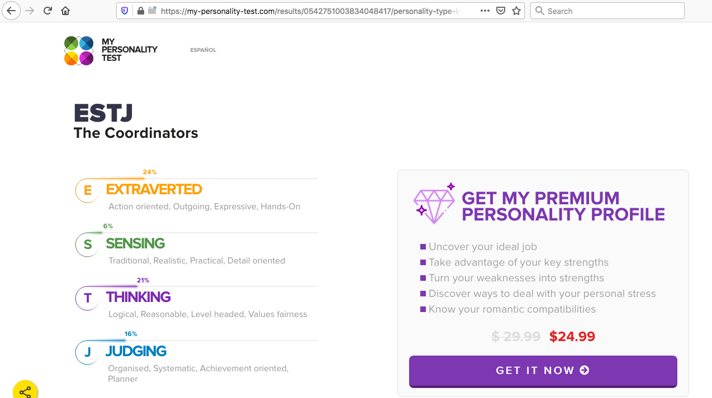
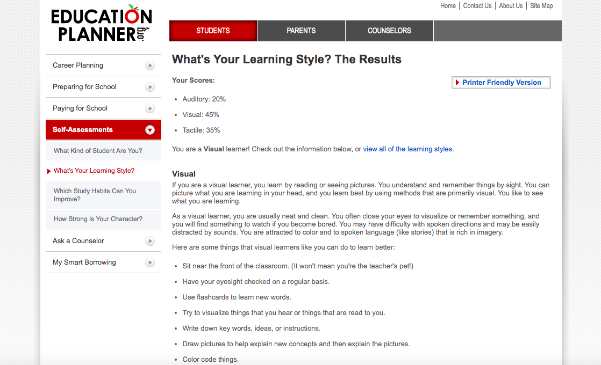
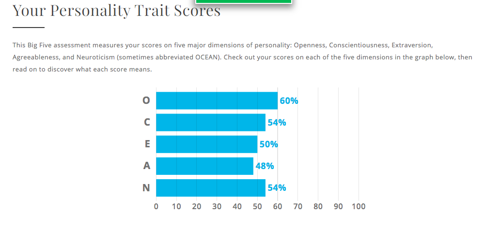

# My Profile

### About Me

**Name**: Roshy Sarabhai  
**Student Number**: s3858023  
**Email id**: roshy.sarabhai@gmail.com
An investment advisor by profession, have always loved playing with numbers, stock markets etc.  
Born in Mumbai, India and have been down under since 2016 with my wife Neha and son Ahaan.  
I love travelling, photography and an absolute foodie.  

### Interests in IT

As a child, I have had immense passion for technology and was always fascinated by fridge lights going on and off and this fascination increased by ever evolving technology and gadets. I would like to move to IT sales and live my passion. This course is a perfect stepping stone to understand this magnificent world of Technology.

### Ideal Job

[Job link](https://www.seek.com.au/job/41157161?type=standard#searchRequestToken=e639c67e-0cc0-4f94-aa63-abdb18ac42cb)

This position is about the role an Account Executive. This roles appeals to me as it is about managing customer relationships. I have had over 14 years of experience in managing customer relationship in banking and financial sector.

One major skill required in this role is of understanding of information technology and its various streams.

The skills I have for this role:

•	Client rapport and Account management
•	Business development
•	Business strategies and strategic planning
•	Revenue development and Portfolio growth
•	Passionate sales professional	•	Excellent multi-tasker
•	High-energy attitude
•	MS Office proficient
•	Superior communication skills
•	CRM and Relationship builder

Doing this course will give me the perfect platform to understand fundamentals of IT. 

### Personal Profile

 Myers-Briggs test :
 
 
 
 Online Learing Style Test :
 
 
 
 Big Five Personality Test :
 
 
 
 **What do results of these tests mean to me!**
 
 Gives me a fair introspection in my work and over all personality. Great indication as to where I can improve in my over all working    behavior.

**How do you think these results may influence your behaviour in a team?**

My personality test indicates I am 48% agreeable. I guess that a reasonable percentage to work in a team. However I would like to move that upwards to atleast 70% so that the team can feel totally comfortable in sharing details and suggestions with me. 

**How should you take this into account when forming a team?**

I would make sure my teammates possess qualities which I I lack so we can have a balance in the team.

 
 
 
 
 
